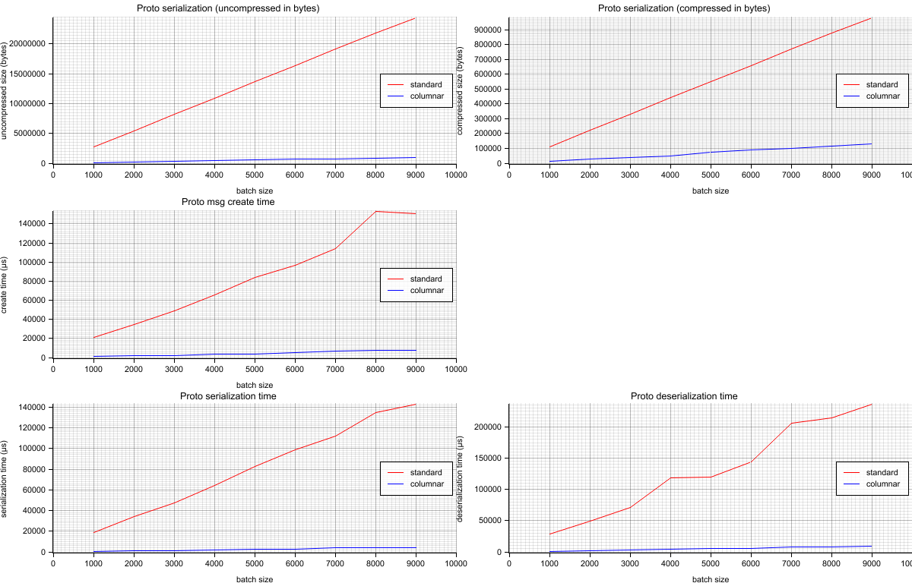

# Open Telemetry - Multivariate time-series experiment

## Introduction
The current OTEL protocol doesn't natively support multivariate time-series. 
This repository adds the support for multivariate time-series at the protocol level in a backward compatible manner. 
An [OTEP document](https://github.com/lquerel/oteps/blob/main/text/metrics/0000-multivariate-timeseries.md) is visible for more details on why multivariate time-series are important. 

Status: This IS a work-in-progress work and IS NOT an official implementation of the OpenTelemetry protocol. Histogram and summary are not yet supported.

## Dataset
* 10000 data points represented in JSON (size uncompressed 6009735 bytes).
* Number of attributes per data point = 9
* Number of metrics per data point = 8

## Results
* The standard representation is using the current implementation of the OTEL protocol.
* The columnar representation is using a compatible evolution of the current implementation of the OTEL protocol.

It's interesting to observe that the uncompressed size of the initial json file (6009735 bytes) is:
* **4 times smaller** than the protobuf standard representation
* **6.1 times bigger** than the protobuf columnar representation

Overall the columnar representation is definitively better in every dimension (time and space), see the performance results in the right column.



```
Multivariate time-series experiment (batch of 1000 data points)
Standard representation:
	uncompressed size: 2729620 bytes
	compressed size: 110580 bytes
	protobuf creation time: 0.016684427s
	protobuf serialization time: 0.014642561s
	protobuf deserialization time: 0.021810162s

Columnar representation:
	uncompressed size: 108752 bytes				(25 times smaller)
	compressed size: 13437 bytes				(8 times smaller)
	protobuf creation time: 0.000718829s			(23.21056468228188 times faster)
	protobuf serialization time: 0.00040254s		(36.37541859194118 times faster)
	protobuf deserialization time: 0.000865789s		(25.19108235378366 times faster)

Multivariate time-series experiment (batch of 2000 data points)
Standard representation:
	uncompressed size: 5459284 bytes
	compressed size: 221458 bytes
	protobuf creation time: 0.029313937s
	protobuf serialization time: 0.028058696s
	protobuf deserialization time: 0.043530011s

Columnar representation:
	uncompressed size: 216963 bytes				(25 times smaller)
	compressed size: 25877 bytes				(8 times smaller)
	protobuf creation time: 0.001367859s			(21.43052536847731 times faster)
	protobuf serialization time: 0.000771419s		(36.372834996286066 times faster)
	protobuf deserialization time: 0.001901824s		(22.88855908853816 times faster)

Multivariate time-series experiment (batch of 3000 data points)
Standard representation:
	uncompressed size: 8189004 bytes
	compressed size: 331017 bytes
	protobuf creation time: 0.047844367s
	protobuf serialization time: 0.04264291s
	protobuf deserialization time: 0.063968935s

Columnar representation:
	uncompressed size: 325186 bytes				(25 times smaller)
	compressed size: 38199 bytes				(8 times smaller)
	protobuf creation time: 0.002016491s			(23.726546262790162 times faster)
	protobuf serialization time: 0.001230772s		(34.64728641860556 times faster)
	protobuf deserialization time: 0.002646601s		(24.17022248536897 times faster)

Multivariate time-series experiment (batch of 4000 data points)
Standard representation:
	uncompressed size: 10918380 bytes
	compressed size: 440153 bytes
	protobuf creation time: 0.05757246s
	protobuf serialization time: 0.056673369s
	protobuf deserialization time: 0.091069484s

Columnar representation:
	uncompressed size: 433360 bytes				(25 times smaller)
	compressed size: 50348 bytes				(8 times smaller)
	protobuf creation time: 0.002630734s			(21.884561495004817 times faster)
	protobuf serialization time: 0.001672692s		(33.881532882323825 times faster)
	protobuf deserialization time: 0.003292396s		(27.660549945996777 times faster)

Multivariate time-series experiment (batch of 5000 data points)
Standard representation:
	uncompressed size: 13647844 bytes
	compressed size: 549455 bytes
	protobuf creation time: 0.075339951s
	protobuf serialization time: 0.072266203s
	protobuf deserialization time: 0.107525461s

Columnar representation:
	uncompressed size: 541543 bytes				(25 times smaller)
	compressed size: 73217 bytes				(7 times smaller)
	protobuf creation time: 0.003415727s			(22.056783519291795 times faster)
	protobuf serialization time: 0.002053679s		(35.188655578598215 times faster)
	protobuf deserialization time: 0.004256933s		(25.258903769450917 times faster)

Multivariate time-series experiment (batch of 6000 data points)
Standard representation:
	uncompressed size: 16377732 bytes
	compressed size: 658777 bytes
	protobuf creation time: 0.088706763s
	protobuf serialization time: 0.092230799s
	protobuf deserialization time: 0.131768208s

Columnar representation:
	uncompressed size: 649779 bytes				(25 times smaller)
	compressed size: 87701 bytes				(7 times smaller)
	protobuf creation time: 0.00434102s			(20.434543724746717 times faster)
	protobuf serialization time: 0.002427495s		(37.99422820644327 times faster)
	protobuf deserialization time: 0.005483407s		(24.03035339160489 times faster)

Multivariate time-series experiment (batch of 7000 data points)
Standard representation:
	uncompressed size: 19106940 bytes
	compressed size: 768454 bytes
	protobuf creation time: 0.103278186s
	protobuf serialization time: 0.099965584s
	protobuf deserialization time: 0.154669532s

Columnar representation:
	uncompressed size: 757930 bytes				(25 times smaller)
	compressed size: 102040 bytes				(7 times smaller)
	protobuf creation time: 0.005053207s			(20.438146705646535 times faster)
	protobuf serialization time: 0.002919377s		(34.24209480310354 times faster)
	protobuf deserialization time: 0.00639032s		(24.20372250528925 times faster)

Multivariate time-series experiment (batch of 8000 data points)
Standard representation:
	uncompressed size: 21836636 bytes
	compressed size: 878695 bytes
	protobuf creation time: 0.116169584s
	protobuf serialization time: 0.123056651s
	protobuf deserialization time: 0.17180082s

Columnar representation:
	uncompressed size: 866142 bytes				(25 times smaller)
	compressed size: 114998 bytes				(7 times smaller)
	protobuf creation time: 0.005874971s			(19.773643818837577 times faster)
	protobuf serialization time: 0.00356761s		(34.4927419196605 times faster)
	protobuf deserialization time: 0.007076257s		(24.27848790681288 times faster)

Multivariate time-series experiment (batch of 9000 data points)
Standard representation:
	uncompressed size: 24566156 bytes
	compressed size: 987544 bytes
	protobuf creation time: 0.135045136s
	protobuf serialization time: 0.130820358s
	protobuf deserialization time: 0.200258067s

Columnar representation:
	uncompressed size: 974338 bytes				(25 times smaller)
	compressed size: 128650 bytes				(7 times smaller)
	protobuf creation time: 0.00683387s			(19.76115085595717 times faster)
	protobuf serialization time: 0.004060576s		(32.21719233921493 times faster)
	protobuf deserialization time: 0.008957494s		(22.356483520949052 times faster)
```

To reproduce this benchmark you need:
- Install Rust: ```curl --proto '=https' --tlsv1.2 -sSf https://sh.rustup.rs | sh```
- Clone this repo
- ```cargo run --release```