# Multivariate Metrics - Benchmark

## Introduction

This benchmark tests the 3 followings implementations:
* **OTEL v1** based on the current univariate metric support.
* **OTEL columnar** based on an extension of the OTEL protocol. In addition to the existing Metrics, Log and Trace object, this extension adds the generic type Event that supports a columnar representation of the data.
* **OTEL arrow** based on an extension of the Event OTEL object embedding an [arrow](https://arrow.apache.org/) buffer.

The internal structure of the resource object is described below.

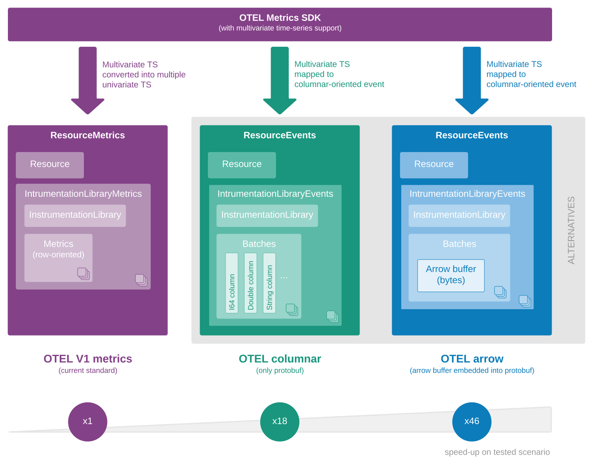

> Note: OTEL columnar and OTEL arrow can be used to represent metrics, logs and traces.

## Scenario

For each implementation, the following operations are performed:
* **Batch creation**: creation of multiple batches of different sizes.
* **Batch processing**: execution of an equivalent processing for each batch.
* **Serialization**: serialization of the entire protobuf message for each batch.
* **Compression**: compression of the entire serialization result for each batch (LZ4).
* **Decompression**: decompression of the previously compressed batches (LZ4).
* **Deserizalization**: deserialization of the previously uncompressed batches.

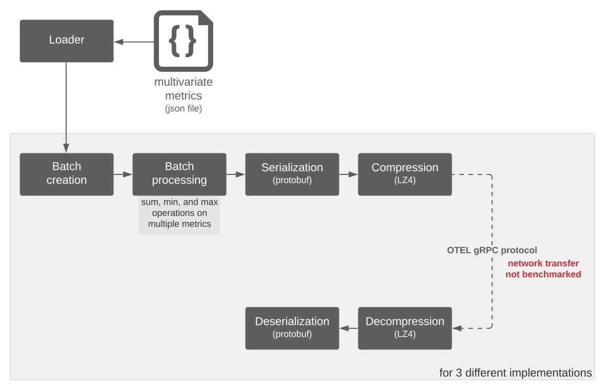

The dataset used for this benchmark can be found [here](data/multivariate-time-series.json).

Each event is composed of 9 labels (dimensions) and 8 metrics.

## Comparative performance
As demonstrated by the following chart, both the OTEL columnar and OTEL arrow are much more efficient than the current OTEL implementation.

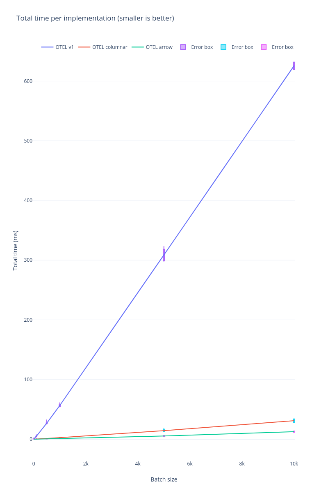

## Speed up per operation
### OTEL columnar
Speed ups per operation of the **OTEL columnar** implementation compared OTEL v1 (batch size=10000):
* Batch creation is 11.5 faster
* Batch processing is **5.1 faster**
* Serialization is 40.8 faster
* Compression is **28 faster**
* Decompression is **19.7 faster**
* Deserialization is **20.7 faster**
* Total is 18.7 faster

In this implementation most of the time is spent in the batch creation and deserialization steps.

### OTEL arrow
Speed ups per operation of the **OTEL arrow** implementation compared OTEL v1 (batch size=10000):
* Batch creation is **31.1 faster**
* Batch processing is 1.7 faster (need more attention)
* Serialization is **424 faster**
* Compression is 8.5 faster
* Decompression is 10.7 faster
* Deserialization is **121.6 faster**
* Total is **46.5 faster**

For more details see the following charts. 

Implementation 1 & 3       | Implementation 2         
:-------------------------:|:------------------------:
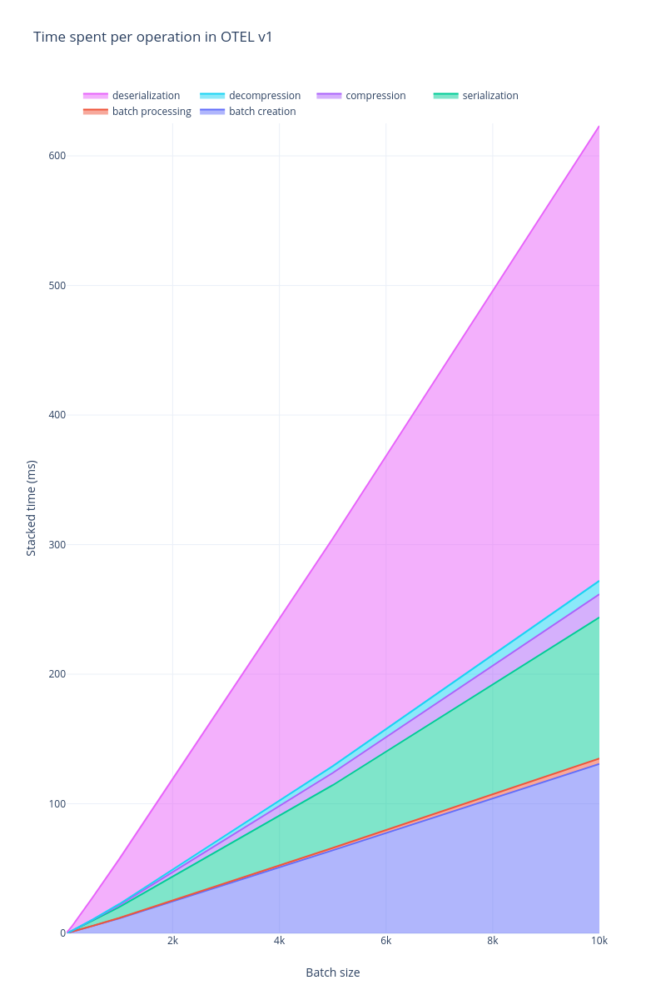 |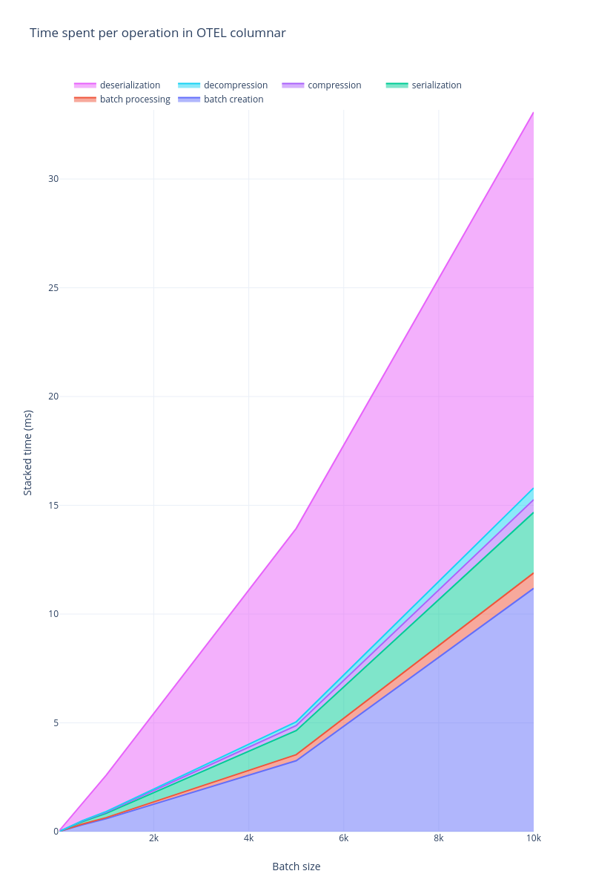 
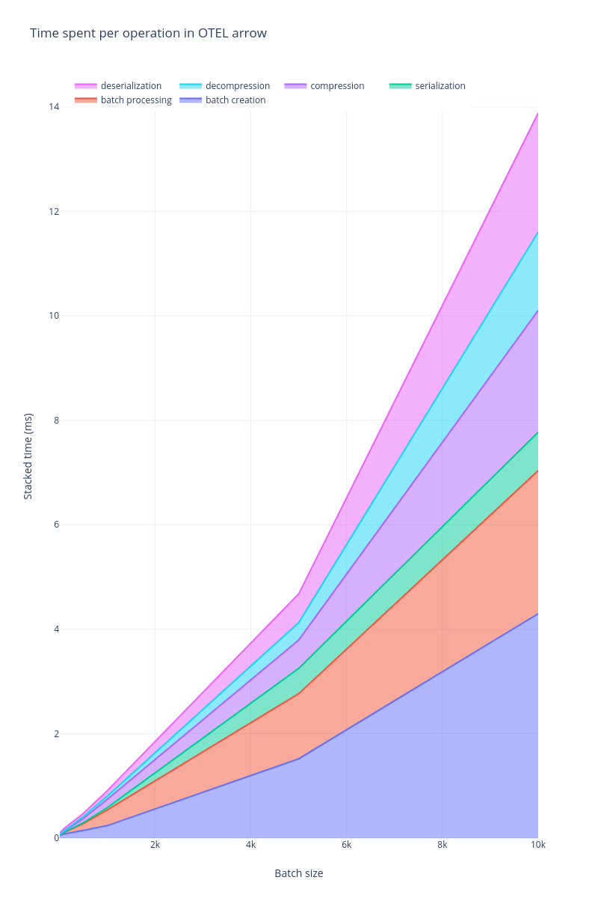|

## Breakdown

The following charts detail the results for the different operations.

### Batch creation and batch processing

Batch creation     | Batch processing
:-------------------------:|:------------------------:
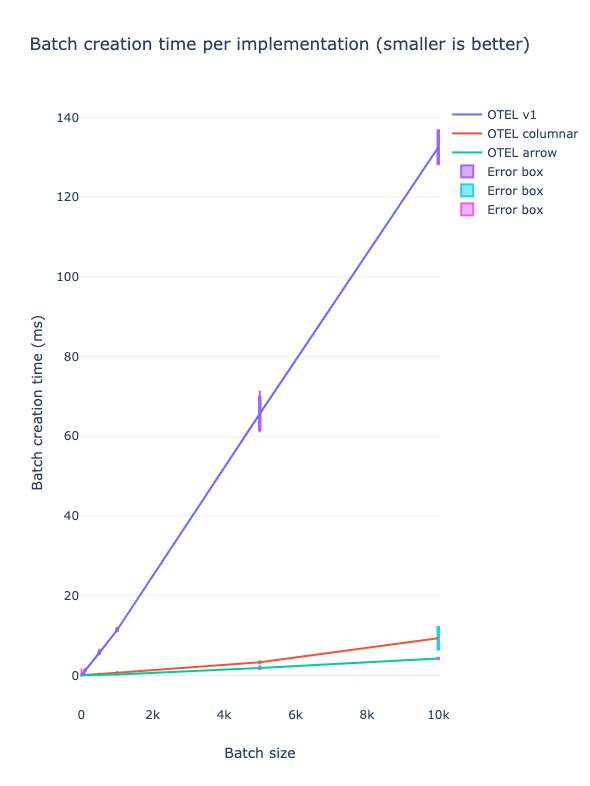 |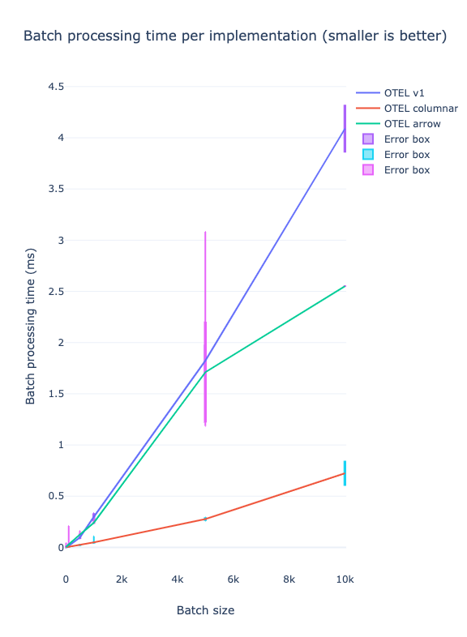 

> Note: Need to test the new implementation of the Apache Arrow (arrow-rs v2).

### Serialization and compression

Serialization     | Compression
:-------------------------:|:------------------------:
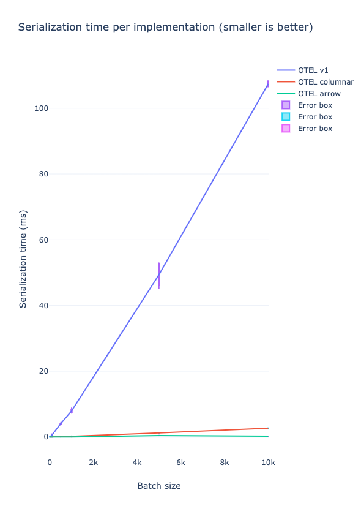 |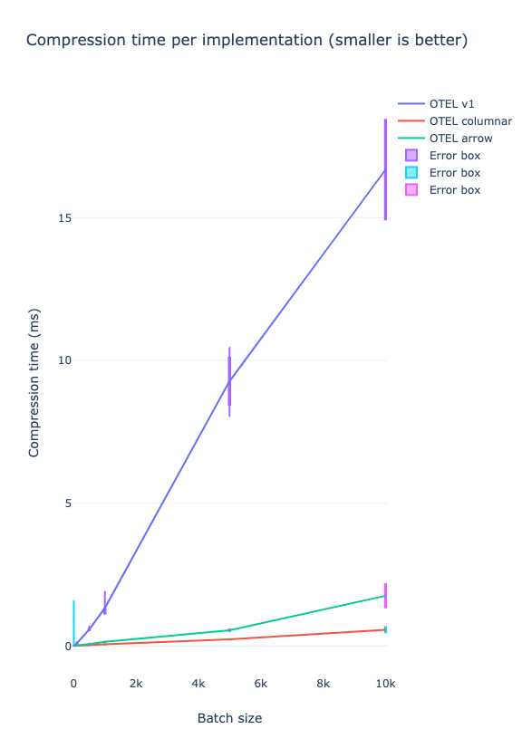 

### Decompression and deserialization
Decompression     | Deserialization 
:-------------------------:|:------------------------:
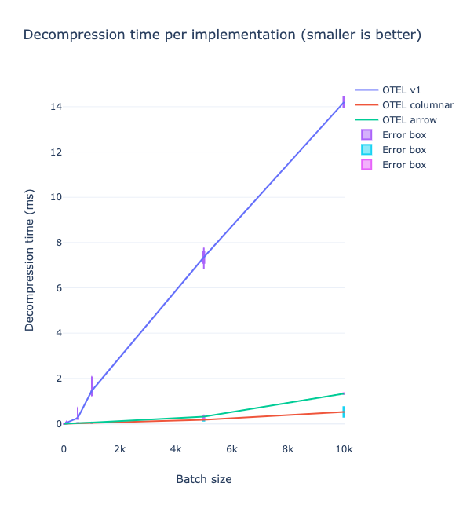 |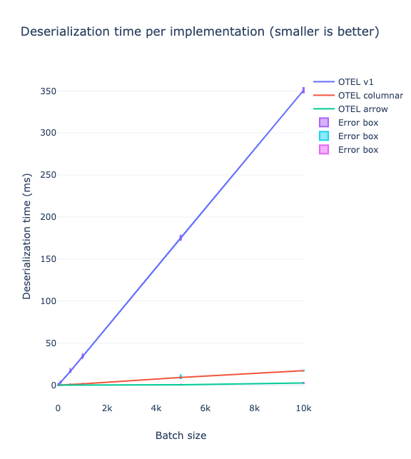 

### Buffer size (uncompressed and compressed)

As expected the uncompressed size of the OTEL v1 implementation (after serialization) is significantly higher than the 2 other columnar-oriented implementations. Even after LZ4 compression the size of the data transmitted over the network is still better for the 2 columnar-oriented implementations.

Uncompressed     | Compressed
:-------------------------:|:------------------------:
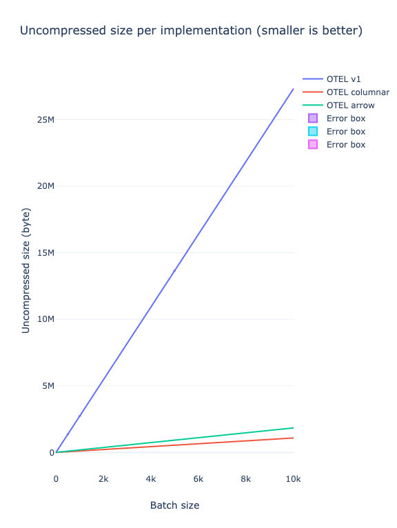 |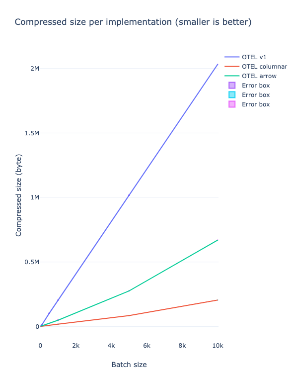 

## Recommendations

Embedding Apache Arrow in the OpenTelemetry protocol has multiple benefits:
* Generic solution to support any kinds of events.
* Better overall performance. 
* Efficient data processing library available.
* Direct integration with stream processing and database solutions.
